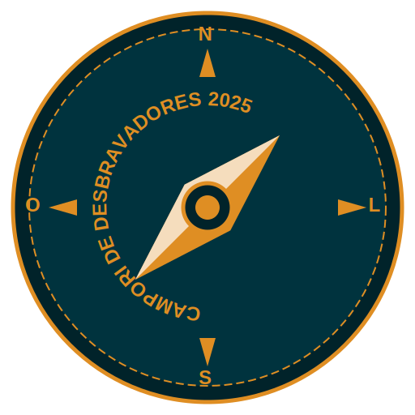

# Site do Campori de Desbravadores 2025

[](https://campori2025.com.br)

Um site moderno e interativo para o evento Campori de Desbravadores, desenvolvido com React, TypeScript, Vite e TailwindCSS.

## 🚀 Tecnologias

- [React](https://reactjs.org/) - Biblioteca para construção de interfaces
- [TypeScript](https://www.typescriptlang.org/) - Superset tipado de JavaScript
- [Vite](https://vitejs.dev/) - Build tool ultrarrápida para desenvolvimento
- [TailwindCSS](https://tailwindcss.com/) - Framework CSS utilitário
- [Framer Motion](https://www.framer.com/motion/) - Biblioteca de animações para React
- [React PDF](https://react-pdf.org/) - Visualizador de PDF para React
- [Lucide React](https://lucide.dev/) - Conjunto de ícones para React

## 📋 Funcionalidades

- **Slideshow:** Carrossel de imagens dos eventos anteriores na página inicial
- **Navbar Responsiva:** Links para as diferentes seções do site
- **Contagem Regressiva:** Timer animado para a data do evento (15-18 de Outubro de 2025)
- **Player de Música:** Reproduz a música tema do Campori automaticamente
- **Seção Sobre:** Informações detalhadas sobre o evento, propósito e público-alvo
- **Seção Local:** Detalhes do endereço, data e mapa interativo
- **Blog e Notícias:** Cards informativos com as últimas atualizações
- **Boletins Informativos:** Visualizador de PDFs integrado para consulta dos documentos
- **Galeria de Fotos:** Grid responsivo com lightbox para visualização ampliada
- **Fundo Animado:** Partículas interativas e animadas como plano de fundo
- **Design Responsivo:** Adaptado para todos os dispositivos (desktop, tablet, mobile)

## 🎨 Design

O site segue a paleta de cores oficial do evento:

- **Laranja (#df8e23)** - Cor primária, simboliza energia e aventura
- **Azul Petróleo Escuro (#01232a)** - Cor secundária, simboliza profundidade e calma
- **Azul Esverdeado Escuro (#00333e)** - Cor terciária, complementa o esquema de cores

## 🛠️ Instalação e Uso

Clone o repositório:

```bash
git clone https://github.com/sua-organizacao/campori-site.git
cd campori-site
```

Instale as dependências:

```bash
npm install
```

Inicie o ambiente de desenvolvimento:

```bash
npm run dev
```

Acesse `http://localhost:5173` no seu navegador.

## 📦 Build para Produção

Para gerar a versão de produção:

```bash
npm run build
```

Os arquivos otimizados serão gerados na pasta `dist`.

## 🧪 Testes

Execute os testes com:

```bash
npm test
```

## 🚧 Estrutura do Projeto

```
campori-site/
├── public/              # Arquivos públicos
│   ├── slideshow/       # Imagens para o carrossel
│   ├── gallery/         # Imagens para a galeria
│   ├── blog/            # Imagens para o blog
│   ├── bulletins/       # PDFs dos boletins
│   ├── logo-campori.svg # Logo em SVG
│   └── musica-tema.mp3  # Música tema
├── src/
│   ├── components/      # Componentes React
│   │   ├── about/       # Componentes da seção Sobre
│   │   ├── blog/        # Componentes da seção Blog
│   │   ├── bulletins/   # Componentes da seção Boletins
│   │   ├── gallery/     # Componentes da seção Galeria
│   │   ├── home/        # Componentes da página inicial
│   │   ├── layout/      # Componentes de layout (Navbar, Footer)
│   │   └── location/    # Componentes da seção Local
│   ├── pages/           # Páginas da aplicação
│   ├── utils/           # Utilitários e helpers
│   ├── hooks/           # Hooks personalizados
│   ├── context/         # Contextos React
│   ├── App.tsx          # Componente principal
│   └── main.tsx         # Ponto de entrada
└── package.json         # Dependências e scripts
```

## 👥 Contribuição

1. Faça um fork do projeto
2. Crie uma branch para sua feature (`git checkout -b feature/nova-feature`)
3. Commit suas mudanças (`git commit -m 'Adiciona nova feature'`)
4. Push para a branch (`git push origin feature/nova-feature`)
5. Abra um Pull Request

## 📄 Licença

Este projeto está sob a licença MIT. Veja o arquivo [LICENSE](LICENSE) para mais detalhes.

## 📞 Contato

Para mais informações, entre em contato:
- Email: contato@campori2025.com.br
- Website: [campori2025.com.br](https://campori2025.com.br)
